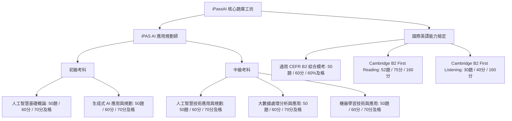

# iPassAI 智慧學習平台 - 專案規劃與架構設計書 (Project Plan & Technical Architecture)

---

## 📌 專案概述 (Executive Summary)

**iPassAI（靛藍題庫工坊）** 是一套專為 **經濟部 iPAS 產業人才能力鑑定（AI 應用規劃師 初級／中級）** 與 **國際英語能力檢定（CEFR B2 / Cambridge B2 First）** 所打造的高效、自適應、離線優先之智慧學習平台。

專案以 **Swiss International Typographic Style（瑞士資訊設計秩序）** 結合 **Editorial Learning Journal（紙本研讀質感）**，核心宗旨是協助考生「**掌握每個選項背後的原理，將試題辨識轉化為應試直覺**」。

---

## 🏛️ 系統架構與技術選型 (System Architecture & Tech Stack)

### 1. 核心技術組合

| 層級 | 核心技術 | 關鍵版本 | 選擇考量與優勢 |
| :--- | :--- | :---: | :--- |
| **前端框架** | [React](https://react.dev/) + [TypeScript](https://www.typescriptlang.org/) | React 19 / TS 5.6 | 強型別約束、元件化架構、極致渲染效能 |
| **建置工具** | [Vite](https://vitejs.dev/) | Vite 7.3+ | 毫秒級熱重載 (HMR)、最佳化 Rollup 打包 |
| **視覺與樣式** | [TailwindCSS](https://tailwindcss.com/) + 自訂 Swiss CSS | Tailwind 4 | 結合原子化 CSS 與 Swiss 嚴謹版面網格 |
| **圖示庫** | [Lucide React](https://lucide.dev/) | 0.453+ | 現代簡約線條圖示、語意化視覺傳達 |
| **跨平台封裝** | [Capacitor](https://capacitorjs.com/) | 7.x / 8.x | 零負擔將 Web 應用編譯為 Android 原生應用 |
| **本機推播** | `@capacitor/local-notifications` | 8.3.1 | 支援 Android Exact Alarm、自訂頻道與自適應隨堂抽考 |
| **單元測試** | [Vitest](https://vitest.dev/) | 2.1.9 | 極速 ESM 測試引擎，覆蓋題庫結構與服務邏輯 |
| **持續整合** | [GitHub Actions](https://github.com/features/actions) | Ubuntu / JDK 21 | 自動化測試、驗證並產出 Release/Debug APK |

---

## 📊 考科標準與全真模考規格矩陣 (Exam Standards Matrix)

系統依據官方考試指南與國際語言框架，精準定義全科目之正式模擬考試規格：



### 詳細考科規劃表

| 考科代號 | 考科名稱 | 級別 | 正式題量 | 正式時間 | 及格標準 | 主要核心考核主題 |
| :--- | :--- | :---: | :---: | :---: | :---: | :--- |
| `ipas-basic-ai` | 人工智慧基礎概論 | 初級 | 50 題 | 60 分鐘 | 70 分 | AI定義、資料概念、機器學習基礎、電腦視覺、NLP、AI倫理治理 |
| `ipas-basic-genai` | 生成式 AI 應用與規劃 | 初級 | 50 題 | 60 分鐘 | 70 分 | LLM原理、提示詞工程、多模態、RAG架構、落地評估與安全防範 |
| `ipas-inter-tech` | 人工智慧技術應用與規劃 | 中級 | 50 題 | 60 分鐘 | 70 分 | 系統架構、MLOps維運、模型生命週期、資料漂移、邊緣運算推論 |
| `ipas-inter-bigdata`| 大數據處理分析與應用 | 中級 | 50 題 | 60 分鐘 | 70 分 | 分散式架構、ETL管線、特徵工程、即時串流處理、大數據品質治理 |
| `ipas-inter-ml` | 機器學習技術與應用 | 中級 | 50 題 | 60 分鐘 | 70 分 | 監督/非監督演算法、集成學習、深度學習、ROC-AUC/F1、XAI可解釋性 |
| `cefr-b2-general` | CEFR B2 國際英語能力 | 中級 | 50 題 | 60 分鐘 | 60% | 語境詞彙、情境文法、克漏字、搭配詞、句型置換、情境語用、應用閱讀 |
| `cambridge-b2-ru` | Cambridge B2 First R&U | 中級 | 52 題 | 75 分鐘 | Grade C | Part 1–7：Multiple Choice, Open Cloze, Word Formation, Transformations |
| `cambridge-b2-ls` | Cambridge B2 First Listening | 中級 | 30 題 | 40 分鐘 | Grade C | Part 1–4：Short Dialogues, Sentence Completion, Multiple Matching |

---

## 🗄️ 資料架構與儲存協議 (Data Schema & Storage Protocol)

### 1. 題庫模型 (`Question`)
```typescript
interface Question {
  id: string;                      // 唯一題號 (如 B2-ENG-CLOZE-001, IPAS-GENAI-042)
  level: "初級" | "中級";           // 難度等級
  subject: string;                 // 所屬考科名稱
  topic: string;                   // 分項考核主題
  difficulty: "基礎" | "情境" | "進階"; // 認知複雜度
  stem: string;                    // 題目主幹
  options: [string, string, string, string]; // 四選一選項
  answer: number;                  // 正確解答索引 (0..3)
  explanation: string;             // 深度核心解題解析
  trap: string;                    // 考生常見易錯盲點提醒
  source: string;                  // 官方標準或大綱出處說明
  sourceUrl?: string;              // 官方考綱/公告試題外部連結
  examFamily?: "Cambridge B2 First";
  component?: "Reading & Use of English" | "Listening";
  part?: string;                   // 例如 Part 1, Part 4
  questionType?: string;           // 例如 Key Word Transformation
  stimulus?: string;               // 閱讀材料長篇文本
  audioScript?: string;            // 聽力題音訊口播逐字稿
}
```

### 2. 裝置端本機儲存鍵值表 (`localStorage`)

| Key 名稱 | 資料型別 | 說明 |
| :--- | :--- | :--- |
| `ipas-study-attempts-v1` | `Attempt[]` | 歷史作答紀錄（含題號、使用者選擇、正誤判定、作答時間戳、模式） |
| `ipas-study-bookmarks-v1` | `string[]` | 考生星號收藏之題號清單 |
| `ipas-study-notes-v1` | `Record<string, string>` | 逐題自訂筆記（以題號為鍵，內容為值） |
| `ipas-study-goal-date-v1` | `string (YYYY-MM-DD)` | 考生目標考期日期字串 |
| `ipas-quiz-notification-config-v1` | `NotificationConfig` | 手機定時抽考推播排程設定（啟用狀態、頻率、科目範圍、錯題優先） |

---

## 🚀 專案里程碑與已完成項目 (Milestones & Accomplishments)

- [x] **階段一：基礎題庫與 Swiss 資訊工坊介面構建**
  - 完成 iPAS AI 初級與中級核心考科原創題庫建置（每科 ≥ 100 題）。
  - 實作紙本研讀質感閱讀板、螢光標記線與左側學習軌道導航。
- [x] **階段二：錯題複盤、弱點雷達與個人化筆記系統**
  - 實作歷史作答自動記錄、錯誤主題排序與「錯題專屬測驗」。
  - 實作題目收藏、逐題筆記、全文檢索與私密 JSON 備份/還原。
  - 實作考期倒數動態題量規劃與連續學習天數統計。
- [x] **階段三：Android 原生封裝與本機定時抽考推播**
  - 整合 Capacitor Android 專案與 GitHub Actions 自動編譯 APK 工作流。
  - 實作 Android Exact Alarm 定時推播排程、錯題優先隨堂抽考與點擊喚起彈窗作答。
- [x] **階段四：CEFR B2 題型全面擴充與全科目全真模擬考**
  - CEFR B2 英文新增篇章克漏字、搭配詞片語、文法句型置換與情境語用四大題型（擴充至 174 題）。
  - 建立全科目「全真標準模考」規格定義與抽題演算法。
  - 考場作答工具升級：題號導覽矩陣、題目標記 (Flag)、倒數 5 分鐘警示、漏答確認對話框。
  - 實作正式成績單：及格判定 (PASS/FAIL)、分項主題掌握度診斷條、一鍵錯題重測與逐題解析。

---

## 🔮 未來展望與路線圖 (Future Roadmap)

1. **主題進步趨勢圖表 (Progress Analytics)**：
   - 繪製各主題隨時間推移的正確率攀升曲線，量化學習成效。
2. **30 天考前衝刺排程演算法 (Sprint Planner)**：
   - 依據考生距離目標考期的剩餘天數，自動調配 iPAS AI 與 CEFR B2 每日混合最佳題型配比。
3. **離線音訊素材離線快取增強**：
   - 擴充更多 Cambridge 聽力情境語音檔，提供多口音朗讀支援。
