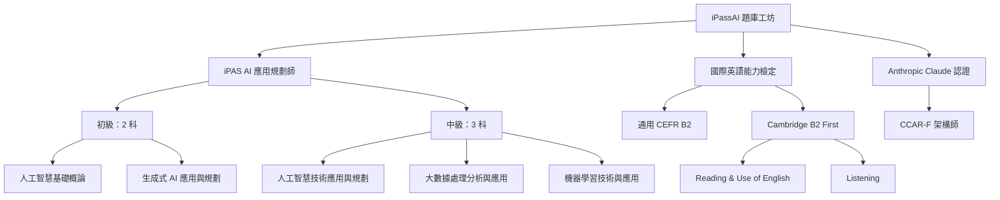

# 專案規劃與技術架構設計書 (Project Plan & Technical Architecture)

> 本文負責**技術架構、資料模型與考科規格**。專案入口與建置方式見 [README](../README.md)；功能操作方式見 [使用者操作指南](USER_GUIDE.md)；題庫來源與內容政策見 [題庫研究依據](RESEARCH_SOURCES.md)。

---

## 📌 專案概述

**iPassAI（靛藍題庫工坊）** 是一套離線優先的智慧學習與全真模考平台，涵蓋三條考試軌道：

| 軌道 | 涵蓋範圍 |
| :--- | :--- |
| **iPAS AI 應用規劃師** | 經濟部產業人才能力鑑定，初級 2 科、中級 3 科 |
| **國際英語能力檢定** | 通用 CEFR B2、Cambridge B2 First（Reading & Use of English、Listening） |
| **Anthropic Claude 認證** | Claude Certified Architect – Foundations (CCAR-F) |

### 設計方向

視覺語言採 **Swiss International Typographic Style（瑞士資訊設計秩序）** 結合 **Editorial Learning Journal（紙本研讀質感）**：深靛藍、米白紙感與螢光標記黃，以左側學習軌道與細長標記線建立方向感，刻意避開通用的置中卡片牆。

核心宗旨是協助考生「**掌握每個選項背後的原理，將試題辨識轉化為應試直覺**」——因此每題都必須同時提供正解依據（`explanation`）與易錯盲點（`trap`），而非只給分數。

---

## 🏛️ 技術選型

| 層級 | 核心技術 | 版本 | 選擇考量 |
| :--- | :--- | :---: | :--- |
| **前端框架** | [React](https://react.dev/) + [TypeScript](https://www.typescriptlang.org/) | React 19 / TS 5.6 | 強型別約束、元件化架構 |
| **建置工具** | [Vite](https://vitejs.dev/) | 7.x | 毫秒級 HMR、Rollup 最佳化打包 |
| **視覺與樣式** | [TailwindCSS](https://tailwindcss.com/) + 自訂 Swiss CSS | Tailwind 4 | 原子化 CSS 結合 Swiss 版面網格 |
| **圖示庫** | [Lucide React](https://lucide.dev/) | 0.453+ | 簡約線條圖示、語意化視覺傳達 |
| **跨平台封裝** | [Capacitor](https://capacitorjs.com/) | 8.x | 零負擔將 Web 應用編譯為 Android 原生應用 |
| **本機推播** | `@capacitor/local-notifications` | 8.3.1 | Android Exact Alarm、自訂頻道與定時抽考 |
| **單元測試** | [Vitest](https://vitest.dev/) | 2.1.x | 極速 ESM 測試引擎 |
| **持續整合** | [GitHub Actions](https://github.com/features/actions) | Ubuntu / JDK 21 | 自動編譯並產出 Debug APK |

> ⚠️ **Tailwind 必須透過 `@tailwindcss/vite` plugin 編譯。** `vite.config.ts` 少掛此 plugin 時，`index.css` 的 `@import "tailwindcss"` 只會被當成一般 CSS 內嵌，打包結果將完全沒有 utility class。詳見 [CLAUDE.md](../CLAUDE.md) 的「踩過的坑」。

---

## 📊 考科規格矩陣

全平台共 **884 題**原創題庫、**9 份**全真模考規格。


```mermaid
graph TD
    A[iPassAI 題庫工坊] --> B[iPAS AI 應用規劃師]
    A --> C[國際英語能力檢定]
    A --> D[Anthropic Claude 認證]

    B --> B1[初級：2 科]
    B --> B2[中級：3 科]
    C --> C1[通用 CEFR B2]
    C --> C2[Cambridge B2 First]
    D --> D1[CCAR-F 架構師]

    B1 --> B1_1[人工智慧基礎概論]
    B1 --> B1_2[生成式 AI 應用與規劃]
    B2 --> B2_1[人工智慧技術應用與規劃]
    B2 --> B2_2[大數據處理分析與應用]
    B2 --> B2_3[機器學習技術與應用]
    C2 --> C2_1[Reading & Use of English]
    C2 --> C2_2[Listening]
```

### 詳細規格表

| 規格 ID | 考科名稱 | 級別 | 題庫量 | 正式題量 | 時間 | 及格標準 |
| :--- | :--- | :---: | :---: | :---: | :---: | :--- |
| `ipas-basic-ai-concepts` | 人工智慧基礎概論 | 初級 | 113 | 50 題 | 60 分 | 70 分（≥35 題） |
| `ipas-basic-genai-planning` | 生成式 AI 應用與規劃 | 初級 | 113 | 50 題 | 60 分 | 70 分（≥35 題） |
| `ipas-intermediate-tech-planning` | 人工智慧技術應用與規劃 | 中級 | 113 | 50 題 | 60 分 | 70 分（≥35 題） |
| `ipas-intermediate-big-data` | 大數據處理分析與應用 | 中級 | 108 | 50 題 | 60 分 | 70 分（≥35 題） |
| `ipas-intermediate-machine-learning` | 機器學習技術與應用 | 中級 | 108 | 50 題 | 60 分 | 70 分（≥35 題） |
| `cefr-b2-general-exam` | 英文能力｜CEFR B2 | 中級 | 206※ | 50 題 | 60 分 | 60%（≥30 題） |
| `cambridge-b2-reading-use-of-english` | Cambridge B2 First · R&UoE | 中級 | 34※ | 52 題 | 75 分 | Grade C（160 Scale） |
| `cambridge-b2-listening` | Cambridge B2 First · Listening | 中級 | 34※ | 30 題 | 40 分 | Grade C（160 Scale） |
| `claude-ccar-f` | Claude 認證｜CCAR-F 架構師 | 專業認證 | 123 | 60 題 | 120 分 | 720/1000（≥44 題） |

※ 206 題為英文科總量，其中 34 題屬 Cambridge B2 First 專屬題型（含聽力語音稿），其餘為通用 CEFR B2。

### CCAR-F 領域權重與配額抽題

Claude 認證是唯一**依領域權重配額抽題**的考科，而非單純隨機抽取——`buildDomainQuota()` 依官方權重換算配額，無條件捨去的餘額優先補給權重最高的領域，確保每份模考都符合官方配比：

| 領域 | 官方權重 | 題庫量 | 60 題模考配額 |
| :--- | :---: | :---: | :---: |
| 代理架構與協作編排 | 27% | 33 | 17 |
| Claude Code 設定與工作流 | 20% | 25 | 12 |
| 提示工程與結構化輸出 | 20% | 25 | 12 |
| 工具設計與 MCP 整合 | 18% | 22 | 10 |
| 情境管理與可靠性 | 15% | 18 | 9 |

---

## 🗄️ 資料架構

### 1. 題庫模型 (`Question`)

```typescript
type Level = "初級" | "中級" | "專業認證";

interface Question {
  id: string;                      // 唯一題號 (如 CCARF-AGT-001, B2-ENG-CLOZE-001)
  level: Level;
  subject: string;                 // 所屬考科名稱，同時是 SUBJECTS 的值
  topic: string;                   // 分項主題；模考分項診斷與領域配額皆依此欄位
  difficulty: "基礎" | "情境" | "進階";
  stem: string;
  options: [string, string, string, string];
  answer: number;                  // 正解索引 0..3
  explanation: string;             // 解題依據（必填）
  trap: string;                    // 易錯盲點提醒（必填）
  source: string;                  // 考綱出處說明
  sourceUrl?: string;              // 官方考綱／考試資訊外部連結
  examFamily?: "Cambridge B2 First";
  component?: "Reading & Use of English" | "Listening";
  part?: string;                   // 例如 Part 1, Part 4
  questionType?: string;           // 例如 Key Word Transformation
  stimulus?: string;               // 閱讀材料長篇文本
  audioScript?: string;            // 聽力題音訊逐字稿
}
```

### 2. 裝置端儲存鍵值 (`localStorage`)

無後端、無登入，所有資料只存在使用者裝置：

| Key | 型別 | 說明 |
| :--- | :--- | :--- |
| `ipas-study-attempts-v1` | `Attempt[]` | 作答紀錄（題號、選擇、正誤、時間戳、模式） |
| `ipas-study-bookmarks-v1` | `string[]` | 收藏題號清單 |
| `ipas-study-notes-v1` | `Record<string, string>` | 逐題筆記（題號為鍵） |
| `ipas-study-goal-date-v1` | `string` | 目標考期 `YYYY-MM-DD` |
| `ipas-quiz-notification-config-v1` | `NotificationConfig` | 推播排程設定（啟用、頻率、範圍） |

---

## 🚀 里程碑

- [x] **階段一：基礎題庫與 Swiss 資訊工坊介面**
  - iPAS 初級／中級五科原創題庫（每科 ≥ 100 題）、紙本質感閱讀板與左側學習軌道。
- [x] **階段二：錯題複盤、弱點雷達與個人化筆記**
  - 作答自動記錄、錯誤主題排序、錯題專屬測驗、收藏／筆記／全文檢索、JSON 備份還原、考期倒數動態題量。
- [x] **階段三：Android 原生封裝與定時抽考推播**
  - Capacitor Android 專案、GitHub Actions 自動編譯 APK、Exact Alarm 定時推播、錯題優先隨堂抽考與點擊喚起作答。
- [x] **階段四：CEFR B2 題型擴充與全科目全真模考**
  - 英文科擴充至 206 題、建立全科模考規格與抽題演算法、考場工具（題號導覽、題目標記、5 分鐘警示、漏答防呆）、正式成績單與分項診斷。
- [x] **階段五：APK 版面修復與 Claude 認證軌道**
  - 修復 `@tailwindcss/vite` plugin 未註冊導致的 APK 版面異常（收藏頁檔案輸入框外露、隨堂抽考彈窗掉到頁尾）。
  - 新增「專業認證」級別與 Claude CCAR-F 考科（123 題），實作依領域權重配額抽題。
  - UI 級別選單改由 `LEVELS` 常數推導，新增級別自動反映於所有下拉選單與考科索引。

---

## 🔮 未來路線圖

1. **主題進步趨勢圖表**：繪製各主題正確率隨時間的攀升曲線，量化學習成效。
2. **考前衝刺排程演算法**：依剩餘天數自動調配跨考科的每日混合題型配比。
3. **擴充 Claude 認證軌道**：現有架構（`LEVELS`、領域配額抽題、品質保證測試）可直接沿用至其餘三張認證 — CCAO-F（使用者）、CCDV-F（開發者）、CCAR-P（專業架構師）。
4. **離線音訊素材增強**：擴充 Cambridge 聽力情境語音與多口音朗讀支援。
